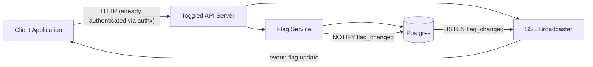

# Toggled — Backend Plan

Toggled is a feature-flag management platform. This document is the shared
reference for the backend: architecture, tech stack, data model, and project
layout. Detailed, independently-buildable specs for each capability live in
[`docs/features/`](features/).

## Scope (v1)

- **Flag model**: on/off flags with a typed value — `boolean`, `string`, or
  `object` (arbitrary JSON). No per-user targeting rules, no segments, no
  percentage rollout.
- **Tenancy**: single-tenant, single environment. No user accounts, orgs, or
  RBAC in this service.
- **Retrieval**: a REST API for pull/polling, plus Server-Sent Events (SSE)
  so client apps get pushed updates the moment a flag changes.
- **Auth is out of scope.** Authentication/authorization for all endpoints is
  handled by a separate application, **authx**, sitting in front of Toggled
  (e.g. as a gateway or shared middleware). Toggled's handlers assume every
  request that reaches them is already authenticated and authorized. Do not
  implement API keys, tokens, sessions, or user accounts in this repo.

## Architecture



Postgres `LISTEN`/`NOTIFY` fans out flag-change events to the SSE
broadcaster. This keeps streaming correct even if the app later runs as
multiple replicas, without adding a separate message broker (e.g. Redis).

## Data model

Single table, `flags`:

| Column | Type | Notes |
|---|---|---|
| `id` | `uuid` | primary key, generated |
| `key` | `text` | unique, immutable slug identifier (e.g. `new-checkout-flow`) |
| `name` | `text` | human-readable display name |
| `description` | `text` | optional |
| `type` | `text` (enum) | one of `boolean`, `string`, `json`; immutable after creation |
| `enabled` | `boolean` | when `true`, evaluation returns `value`; when `false`, returns `default_value` |
| `value` | `jsonb` | must match `type` |
| `default_value` | `jsonb` | must match `type`; returned when `enabled = false` |
| `created_at` | `timestamptz` | |
| `updated_at` | `timestamptz` | |

Full DDL and validation rules are defined in
[`02-flag-management.md`](features/02-flag-management.md).

## Project layout

```
toggled/
  cmd/
    server/
      main.go
  internal/
    config/         # YAML config loading (typed, extensible sections)
    api/            # mux router, HTTP handlers, middleware (logging, recovery)
    domain/         # Flag type + service interfaces
    service/        # flag service: business logic + validation
    store/
      postgres/     # pgx-backed repository, sqlc-generated queries
    stream/          # SSE broadcaster + Postgres LISTEN/NOTIFY listener
  db/
    migrations/     # golang-migrate SQL files
  docs/
    plan.md
    features/
      01-project-foundation.md
      02-flag-management.md
      03-flag-evaluation.md
      04-realtime-streaming.md
  Dockerfile
  docker-compose.yml
  Makefile
  go.mod
```

## Tech stack

| Concern | Choice |
|---|---|
| Language | Go |
| HTTP router | `gorilla/mux` |
| Database | Postgres, via `pgx` v5 |
| Query layer | `sqlc` (typed queries generated from SQL) |
| Migrations | `golang-migrate` |
| Validation | `go-playground/validator` + custom type/value checks |
| Logging | `uber-go/zap` |
| Testing | stdlib `testing` + `testcontainers-go` for Postgres-backed integration tests |

## API conventions

- All endpoints are under `/api/v1`.
- JSON request/response bodies, `Content-Type: application/json` (except the
  SSE stream endpoint).
- Errors use a consistent envelope:

```json
{
  "error": {
    "code": "flag_not_found",
    "message": "no flag exists with key \"new-checkout-flow\""
  }
}
```

- Layering: HTTP handler (`internal/api`) → service (`internal/service`) →
  repository (`internal/store/postgres`). Handlers do request/response
  translation only; validation and business rules live in the service layer.

## Feature index

Build in this order — each file is self-contained and can be picked up by an
agent independently once its dependencies are done:

1. [`01-project-foundation.md`](features/01-project-foundation.md) —
   scaffold, config, DB connection, migrations tooling, local dev setup.
   *Depends on: nothing.*
2. [`02-flag-management.md`](features/02-flag-management.md) — CRUD API for
   flags, typed value validation. *Depends on: 1.*
3. [`03-flag-evaluation.md`](features/03-flag-evaluation.md) — read-only
   runtime API client apps call to fetch flag values. *Depends on: 2.*
4. [`04-realtime-streaming.md`](features/04-realtime-streaming.md) — SSE +
   Postgres `LISTEN`/`NOTIFY` push updates. *Depends on: 2.*

Features 3 and 4 do not depend on each other and can be built in parallel
once feature 2 is done.

## Explicitly out of scope for this backend

- Authentication/authorization (handled by authx).
- Multi-tenancy: projects, environments, organizations, user accounts, RBAC.
- User-attribute targeting rules, segments, percentage rollouts, scheduling.
- Frontend/UI (a future effort).
